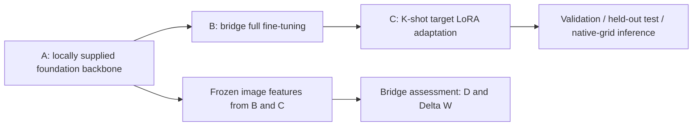

# Bridge-Tuning

**Decoupling Task Priors and Domain Shift: Bridge-Tuning for Few-Shot Medical Image Segmentation**

Minimal source release for the esophageal tumor CT Bridge-Tuning pipeline:
foundation initialization **A**, full-parameter bridge pre-adaptation **A→B**, and
few-shot target LoRA adaptation **B→C**, followed by validation, testing and inference.
Only the private CT experiment profiles are included. The repository contains **no
datasets, example images/labels, CSV indices, experiment-result files or model weights**.
It contains no external comparison methods or comparison experiment drivers.



## Installation

Use Python 3.10 or 3.11. Install the appropriate PyTorch build for your GPU, then:

```bash
python -m pip install -r requirements.txt
python -m pip install -e . --no-deps
```

The implementation uses MONAI 1.4.0. Full training uses feature_size=48 and a 96³
patch; a CUDA GPU is recommended. Dependency versions used in earlier verification
are listed in `requirements-verified.txt`.

## Prepare local inputs

Acquire your own authorized CT images, masks and foundation checkpoint. The target
cohorts are PUCH, HMUCC, FAZZU, HNCH and HNCH-Late; TCGA-ESCA is the bridge cohort.
All paths below are **local placeholders**, not files in this repository.
Create CSV manifests with columns `id,subject_id,image,label`. Image and mask paths
are relative to their CSV, or absolute. Keep every scan from the same subject under
one `subject_id`, and keep training, validation and testing subjects disjoint.

See [dataset preparation](docs/DATASETS.md) and [preprocessing](docs/PREPROCESSING.md).
Preprocessing is performed by the loader; do not apply it twice offline.

## A: foundation initialization

Supply the compatible original Swin UNETR initializer locally. Convert a trusted
legacy checkpoint to this source release's format:

```bash
python convert_checkpoint.py --input weights/foundation_swinunetr.pth \
  --config configs/a_foundation.yaml --role foundation --backbone-only --trusted \
  --output runs/foundation.pt
```

`--trusted` permits loading a legacy file you trust. There is no automatic download.
The converted backbone is an initializer; it requires the following training stages
before tumor segmentation inference. A pretraining itself is not part of this release.

## A→B: bridge pre-adaptation

```bash
python train.py --config configs/b_bridge.yaml \
  --train-csv data/TCGA-ESCA/train.csv --val-csv data/TCGA-ESCA/val.csv \
  --init runs/foundation.pt --role bridge --output runs/bridge --device auto
```

The bridge updates all parameters. The default selects the final checkpoint.
To select the best bridge validation Dice instead, explicitly set
`training.selection: val_dice` and supply a disjoint validation manifest.

## B→C: few-shot target adaptation and testing

Example for PUCH; repeat with the corresponding local manifest for each target center:

```bash
python make_splits.py --csv data/PUCH/all.csv --folds 5 --shots 5 \
  --seeds 0 1 2 --split-seed 1024 --output runs/PUCH/splits

python train.py --config configs/c_target.yaml \
  --train-csv runs/PUCH/splits/fold_0_seed_0_train.csv \
  --init runs/bridge/selected.pt --role target --seed 0 \
  --output runs/PUCH/fold_0_seed_0 --device auto

python evaluate.py --checkpoint runs/PUCH/fold_0_seed_0/selected.pt \
  --csv runs/PUCH/splits/fold_0_test.csv --partition test \
  --output runs/PUCH/fold_0_seed_0/test --device auto
```

Repeat the last two commands for folds 0–4 and support seeds 0–2. Test folds are
fixed across support seeds. Only K labeled training volumes are used per run; there
is no separate target validation set in this few-shot protocol. Use a fresh training
output directory for every fold/seed. [Training rules](docs/TRAINING.md) specify the
optimizer, stopping criterion, checkpoint selection and evaluation units.

For an independently supplied validation set, evaluate the already selected checkpoint:

```bash
python evaluate.py --checkpoint runs/PUCH/fold_0_seed_0/selected.pt \
  --csv data/PUCH/validation.csv --partition validation \
  --output runs/PUCH/validation --device auto
```

This optional evaluation does not change checkpoint selection or create a validation
set for the no-validation few-shot protocol.

## Inference

```bash
python infer.py --checkpoint runs/PUCH/fold_0_seed_0/selected.pt \
  --image data/PUCH/images/local_case.nii.gz \
  --output runs/prediction.nii.gz --device auto
python visualize.py --image data/PUCH/images/local_case.nii.gz \
  --prediction runs/prediction.nii.gz --output runs/overlay.png
```

Inference restores the binary mask to the input image's native shape and affine.
All generated masks, figures, logs and checkpoints remain local and are ignored by Git.

## Label-free bridge assessment

```bash
python extract_features.py --checkpoint runs/foundation.pt \
  --config configs/a_foundation.yaml --csv data/TCGA-ESCA/all.csv \
  --output runs/features_B.npy --device auto
python extract_features.py --checkpoint runs/foundation.pt \
  --config configs/a_foundation.yaml --csv data/PUCH/all.csv \
  --output runs/features_C.npy --device auto
python select_bridge.py --target runs/features_C.npy \
  --bridge TCGA-ESCA=runs/features_B.npy --output runs/bridge_assessment.json
```

Feature extraction reads images only. `D(C→B)` is the target-to-bridge mean nearest
feature distance; `ΔW = W(B)−W(C)`, where W is the trace of sample feature covariance.
Using unlabeled test images for center characterization is a **transductive** setting;
supervised target adaptation remains restricted to K annotated volumes.

## Code and checks

```text
configs/             # A initializer, B bridge, C target: CT only
src/bridge_tuning/   # Model, preprocessing, training, metrics, splits and criteria
docs/                # Dataset setup, preprocessing and training details
tests/               # Fixtures generated temporarily when tests run
train.py / evaluate.py / infer.py
make_splits.py / extract_features.py / select_bridge.py
convert_checkpoint.py / audit_geometry.py / visualize.py
```

```bash
python -m unittest discover -s tests -v
python verify_files.py
```

No data or weights are required to inspect the source. Real training and inference
require the locally supplied inputs described above. See [verification](docs/VERIFICATION.md)
for the scope of the checks; this release is not a claim of newly reproduced paper results.
