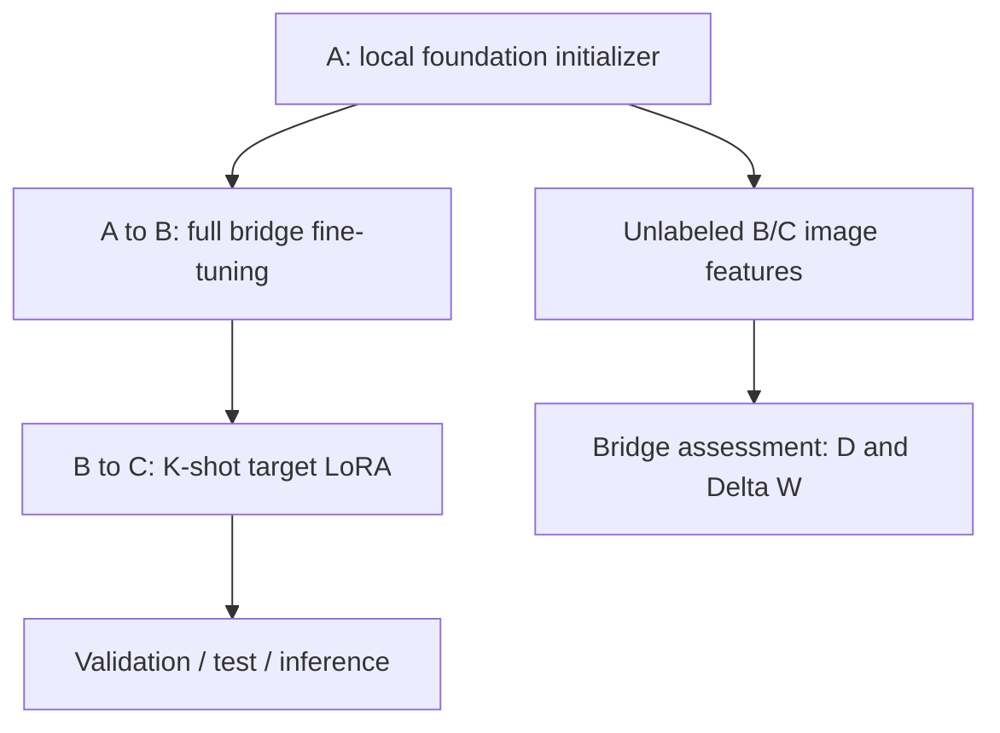

# Bridge-Tuning

**Decoupling Task Priors and Domain Shift: Bridge-Tuning for Few-Shot Medical Image Segmentation**

One Python program for the CT bridge-tuning pipeline: foundation initialization A,
full-parameter bridge pre-adaptation A→B, and K-shot LoRA adaptation B→C, followed by
validation, testing and native-grid inference. Frozen-image bridge assessment is included.
**No datasets, sample images/labels, split CSVs or model weights are distributed.**



```text
bridge_tuning.py     # Entire bridge pipeline and command-line interface
bridge_tuning.yaml   # Shared CT preprocessing and A/B/C parameters
requirements.txt    # Dependencies
README.md           # Data setup, commands and implementation details
.gitignore          # Keep local data, weights and outputs out of Git
```

## Install and prepare local inputs

Use Python 3.10/3.11 and install the PyTorch build appropriate for your GPU, then:

```bash
python -m pip install -r requirements.txt
python bridge_tuning.py --help
```

The backbone is MONAI Swin UNETR, feature size 48, one input channel and two output
classes. Supply a compatible foundation checkpoint separately, attributed to
[Silva-Rodríguez et al. / FSEFT](https://github.com/jusiro/fewshot-finetuning).
A pretraining itself is outside this bridge-adaptation pipeline. Nothing is downloaded automatically.

The CT recipe uses [TCGA-ESCA](https://www.cancerimagingarchive.net/collection/tcga-esca/)
as bridge B and the private PUCH, HMUCC, FAZZU, HNCH and HNCH-Late cohorts as targets C.
Private data require permission from their owners; HNCH-Late is treated independently.
Create your own CSV manifests with columns `id,subject_id,image,label`: one row per
3D NIfTI image/mask pair, paths absolute or relative to that CSV. Use the same
`subject_id` for repeat scans. Image/mask shapes and affine matrices must match;
the loader checks geometry and never rewrites source headers.

All paths below are local placeholders. Use a fresh output directory for each run.

## 1. Initialize A and assess the bridge

Convert a locally obtained, trusted full Swin UNETR initializer. `init` removes the
upstream classifier and validates every remaining tensor against the configured model.
It does not accept an encoder-only file as a full encoder/decoder initializer.

```bash
python bridge_tuning.py init --input weights/foundation_swinunetr.pth \
  --config bridge_tuning.yaml --trusted --output runs/A.pt

python bridge_tuning.py assess --checkpoint runs/A.pt \
  --target-csv data/PUCH/all.csv --bridge-csv data/TCGA-ESCA/all.csv \
  --output runs/bridge_assessment.json --device auto
```

Assessment reads images only, even if a manifest contains label paths. It pools
frozen Swin stage-3 features after whole-foreground resizing to the ROI.
`D(C→B)` is the mean nearest target-to-bridge Euclidean feature distance;
`ΔW = W(B) − W(C)`, where W is the trace of sample feature covariance.
Smaller D and larger ΔW favor a bridge. Repeat `assess` for each candidate using the
same frozen A checkpoint. At least two images per cohort are needed for covariance.
Using all available target images, including test images without labels, is the
**transductive** center-characterization setting. Supervised adaptation uses only K labels.

## 2. Train A→B

Provide a bridge training manifest and, optionally, a disjoint bridge validation manifest:

```bash
python bridge_tuning.py train --stage B --config bridge_tuning.yaml \
  --train-csv data/TCGA-ESCA/train.csv --val-csv data/TCGA-ESCA/val.csv \
  --init runs/A.pt --output runs/B --device auto
```

Stage B updates all parameters. Validation is evaluated every 10 epochs and at the
last epoch. The default selects the final checkpoint. To select the best bridge
validation Dice instead, explicitly set `stages.B.training.selection: val_dice`.
This option requires the disjoint validation manifest.

## 3. Train B→C, validate and test

Generate five fixed **subject-level** test folds. Seeds 0, 1 and 2 independently
sample K support subjects from the other four folds and seed training randomness.
Test folds stay fixed across the three seeds; there is no separate target validation
set. Unselected training-pool subjects do not become test subjects for that fold.

```bash
python bridge_tuning.py split --csv data/PUCH/all.csv --folds 5 --shots 5 \
  --seeds 0 1 2 --split-seed 1024 --output runs/PUCH/splits

python bridge_tuning.py train --stage C --config bridge_tuning.yaml \
  --train-csv runs/PUCH/splits/fold_0_seed_0_train.csv \
  --init runs/B/selected.pt --seed 0 --output runs/PUCH/fold_0_seed_0 --device auto

python bridge_tuning.py evaluate --checkpoint runs/PUCH/fold_0_seed_0/selected.pt \
  --csv runs/PUCH/splits/fold_0_test.csv --partition test \
  --output runs/PUCH/fold_0_seed_0/test --save-predictions --device auto
```

Repeat training and testing for folds 0–4, seeds 0–2, and each private target center.
The split generator registers the release's prospective protocol; it does not
reconstruct unavailable historical splits from a seed alone.

For an independently supplied validation set, evaluate an already selected checkpoint:

```bash
python bridge_tuning.py evaluate --checkpoint runs/PUCH/fold_0_seed_0/selected.pt \
  --csv data/PUCH/validation.csv --partition validation \
  --output runs/PUCH/validation --device auto
```

This optional evaluation does not add a target validation set to the K-shot protocol
or change checkpoint selection. Test labels are never read by `train` or `assess`.

## 4. Inference and visualization

```bash
python bridge_tuning.py infer --checkpoint runs/PUCH/fold_0_seed_0/selected.pt \
  --image data/PUCH/images/local_case.nii.gz --output runs/prediction.nii.gz \
  --overlay runs/overlay.png --device auto
```

The trained C checkpoint is directly callable for inference. The binary uint8 mask
is restored to the input image's original shape, affine and spatial header.
`--overlay` saves a local input/prediction montage; optionally add
`--label data/PUCH/labels/local_case.nii.gz` to show ground truth too.
No label is needed for inference. Example volumes and callable checkpoint binaries
must be supplied locally, in accordance with this source-only release.

## CT preprocessing and optimization

The same preprocessing code is used for training, validation, testing and inference:

1. Reorient image and mask to RAS and resample to **1.5 × 1.5 × 2.0 mm** with
   trilinear image interpolation (MONAI `bilinear` in 3D) and nearest-neighbor masks.
2. Clip image intensities to **[-175,250] HU**, scale `(HU+175)/425` to **[0,1]**,
   and treat all positive tumor labels as foreground.
3. Crop both volumes to the bounding box of positive normalized **image** voxels.
4. For training only, pad if needed and sample **two 96³ patches per volume**,
   with positive:negative center sampling weights 1:1.
5. Train-only augmentation: independently flip each axis with probability 0.3,
   randomly rotate by multiples of 90° with probability 0.3, and independently
   scale/shift intensity by ±0.1 with probability 0.2. Augmented intensities may
   extend outside [0,1]. Evaluation uses the full cropped volume with sliding-window
   inference and 0.5 overlap, without random crops.

| Parameter | A→B | B→C |
|---|---|---|
| Update | Full fine-tuning | Swin attention qkv LoRA + full decoder/head |
| LoRA rank / alpha / dropout | — | 8 / 16 / 0.1 |
| Encoder convolutions | Trainable | Frozen |
| Loss / optimizer | Dice + cross entropy / AdamW | Same |
| Learning rate / weight decay | 0.0001 / 0.01 | 0.0005 / 0.00001 |
| Warmup / maximum epochs | 10 / 200 | 20 / 300 |
| Schedule | Linear warmup, then cosine | Same |
| Volume batch / patches per volume | 2 / 2 | 4 / 2 |
| Patch microbatch / precision | 2 / FP32 | 2 / FP32 |
| Early stopping | Disabled | Training-loss plateau |
| Default checkpoint | Last completed epoch | Last completed epoch |

Bias and one-dimensional normalization parameters are excluded from weight decay.
Weighted microbatch gradient accumulation preserves the effective patch batch,
including a smaller final batch. C early stopping starts after 40 epochs: compare
the latest 10-epoch smoothed training loss with `smoothed[-30]`, and stop if the
relative decrease is below 1% (an increasing loss also meets this condition).
No validation or test metric participates in that stopping rule.
Local outputs include `final.pt`, `selected.pt`, optional `best.pt`, loss history,
resolved configuration and split registration. LoRA adapters are recreated and
loaded strictly for evaluation and inference.

Evaluation reports foreground Dice and symmetric pooled-surface HD95 on the
resampled/cropped grid. HD95 defaults to **voxel units**; request `--hd95-unit mm`
for physical distances. Both-empty masks give Dice=1/HD95=0; one-empty masks use
the configured finite HD95 penalty of 100 in the selected units. Zero-Dice cases
are retained. `metrics.json` reports per-case results and case-level mean/sample
SD (`ddof=1`, null for fewer than two cases), **not seed-level uncertainty**.
For a seed-level summary, first average completed fold means within each seed,
then report the three seed averages and their sample SD; dependent folds/seeds
are not independent patients.

## Manuscript results

Reported Bridge-Tuning 5-shot mean values from the supplied manuscript (Dice on
the 0–1 scale; HD95 in voxels). These are reference values, not a rerun by this release.

| Target | Dice | HD95 |
|---|---:|---:|
| PUCH | 0.585 | 23.5 |
| HMUCC | 0.582 | 26.0 |
| FAZZU | 0.644 | 42.7 |
| HNCH | 0.668 | 20.6 |
| HNCH-Late | 0.554 | 40.9 |
| Mean over centers | 0.607 | 30.7 |

Only the bridge method is implemented. On 2026-10-07, the five-file release passed
8 core checks, all 7 command startup checks, and a two-epoch-per-stage software run
with locally generated temporary volumes (feature size 12, ROI 64³). Validation,
testing, frozen assessment, strict LoRA reload, native-grid inference and montages
were checked. The default feature-size-48 architecture also accepted all 157
non-head tensors of the archived foundation initializer. These checks do not
reproduce full clinical training or establish the reference performance.
No test fixtures or run artifacts are distributed.

## Attribution and license

[MONAI](https://github.com/Project-MONAI/MONAI) supplies Swin UNETR under Apache-2.0;
its implementation is used as a dependency. Separately obtained data and foundation
weights retain their providers' conditions.

MIT License — Copyright (c) 2026 Bridge-Tuning authors

Permission is hereby granted, free of charge, to any person obtaining a copy
of this software and associated documentation files (the "Software"), to deal
in the Software without restriction, including without limitation the rights
to use, copy, modify, merge, publish, distribute, sublicense, and/or sell
copies of the Software, and to permit persons to whom the Software is
furnished to do so, subject to the following conditions:

The above copyright notice and this permission notice shall be included in all
copies or substantial portions of the Software.

THE SOFTWARE IS PROVIDED "AS IS", WITHOUT WARRANTY OF ANY KIND, EXPRESS OR
IMPLIED, INCLUDING BUT NOT LIMITED TO THE WARRANTIES OF MERCHANTABILITY,
FITNESS FOR A PARTICULAR PURPOSE AND NONINFRINGEMENT. IN NO EVENT SHALL THE
AUTHORS OR COPYRIGHT HOLDERS BE LIABLE FOR ANY CLAIM, DAMAGES OR OTHER
LIABILITY, WHETHER IN AN ACTION OF CONTRACT, TORT OR OTHERWISE, ARISING FROM,
OUT OF OR IN CONNECTION WITH THE SOFTWARE OR THE USE OR OTHER DEALINGS IN THE
SOFTWARE.
