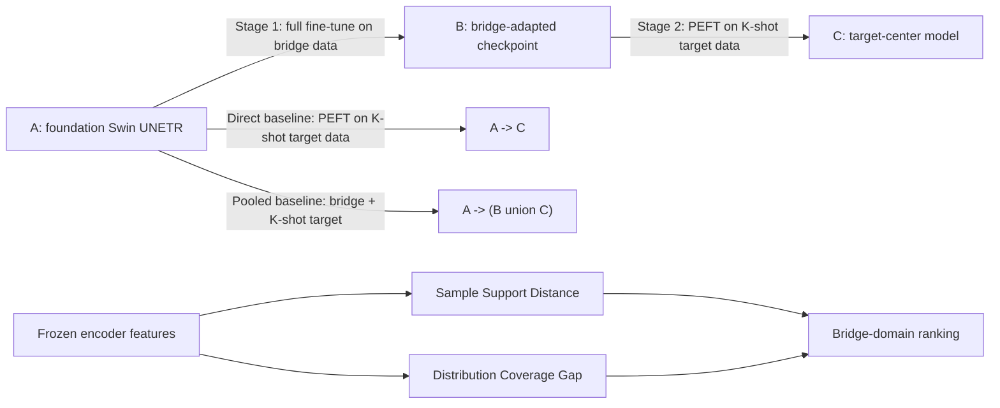

# Bridge-Tuning for Few-Shot Medical Image Segmentation

This anonymous repository contains the core implementation of **Bridge-Tuning**, a two-stage fine-tuning strategy for few-shot medical image segmentation.

The released code focuses on the method itself:

- Swin UNETR backbone wrappers.
- PEFT variants used in the paper: full fine-tuning, linear probing, BitFit, and LoRA.
- Bridge-Tuning training path: foundation model `A` -> bridge model `B` -> target model `C`.
- Bridge-domain selection criteria: Sample Support Distance and Distribution Coverage Gap.
- Minimal inference and visualization scripts.
- Paper result tables for quick reference.

Private clinical data, private data indices, patient-level predictions, and large model weights are not included.

## Method Flow



Bridge-Tuning decouples task-prior learning from target-domain adaptation:

1. **Stage 1, A -> B:** fine-tune the foundation model on an annotated bridge dataset to obtain a task-adapted initialization.
2. **Stage 2, B -> C:** adapt the bridge checkpoint to a few labeled target volumes using PEFT.
3. **Bridge selection:** before target adaptation, rank candidate bridge domains with frozen feature-space criteria.

## Code Tree

```text
Bridge-Tuning/
|-- main.py                       # Training entry point
|-- lib/
|   |-- bridge_models/            # Bridge model wrappers and data loaders
|   |-- data/                     # CSV-based MONAI datasets and transforms
|   |-- models/                   # Swin UNETR, LoRA, BitFit, linear probing
|   |-- modules/
|   |-- tools/                    # Metrics, logging, checkpoints, result tables
|   |-- trainers/                 # Bridge/target training and cross-validation
|   `-- utils.py
|-- configs/
|   |-- stage1_bridge_pretrain.yaml
|   `-- stage2_bridge_tuning.yaml
|-- scripts/
|   |-- infer.py
|   |-- bridge_selection.py
|   `-- unified_eval.py
|-- data/example_csv/
|   `-- samples.csv
|-- weights/
|   `-- README.md
|-- requirements.txt
|-- .gitignore
`-- README.md
```

## Environment

```bash
conda create -n bridge-tuning python=3.10 -y
conda activate bridge-tuning
pip install -r requirements.txt
```

The code expects 3D CT/MRI volumes in NIfTI format and uses MONAI preprocessing.

## Data CSV Format

Each CSV must contain at least two columns:

```csv
image,label
images/case_001.nii.gz,labels/case_001.nii.gz
images/case_002.nii.gz,labels/case_002.nii.gz
```

Relative paths are resolved from the `data_path` configured for each center. Absolute paths are also accepted. See `data/example_csv/samples.csv`.

Private center data are not released. For paper experiments, each target split samples `K=5` or `K=10` labeled target volumes for adaptation, and evaluates on the remaining target volumes. Runs are repeated over three sampling seeds.

## Model Weights

Place model files under `weights/`:

```text
weights/
|-- foundation_swinunetr.pth
|-- bridge_tcga_esca_swinunetr.pth
`-- target_lora_checkpoint.pth
```

The Swin UNETR architecture is from MONAI. The foundation checkpoint should be downloaded from the corresponding released foundation-model source used by the paper. Large weights are intentionally not committed.

## Training

Stage 1 creates the bridge checkpoint:

```bash
python main.py configs/stage1_bridge_pretrain.yaml
```

Stage 2 runs few-shot target adaptation from both the foundation checkpoint and the bridge checkpoint:

```bash
python main.py configs/stage2_bridge_tuning.yaml
```

Important fields in `configs/stage2_bridge_tuning.yaml`:

- `weight_paths.foundation`: checkpoint for direct `A -> C`.
- `weight_paths.bridge`: checkpoint for `A -> B -> C`.
- `peft_methods`: choose `SwinUNETRLoRA`, `SwinUNETRBitFit`, `SwinUNETRLinear_Prob`, or `SwinUNETRModel`.
- `k_shot`: few-shot budgets, for example `[5, 10]`.
- `random_seeds`: sampling seeds.

## Inference

Run single-volume inference with a trained checkpoint:

```bash
python scripts/infer.py \
  --image /path/to/image.nii.gz \
  --checkpoint weights/target_lora_checkpoint.pth \
  --model lora \
  --output-dir outputs/infer_case001
```

The script writes:

- `prediction_preprocessed.npy`: predicted mask in the preprocessed space.
- `prediction_preprocessed.nii.gz`: NIfTI mask if `nibabel` is installed.
- `overlay.png`: center or lesion-slice visualization.

## Bridge Selection Criteria

Given frozen encoder feature files saved as `.npz` with key `features`, rank candidate bridges:

```bash
python scripts/bridge_selection.py \
  --target-features features/target_center.npz \
  --bridge-features bridge_a=features/bridge_a.npz bridge_b=features/bridge_b.npz \
  --out results/bridge_selection.csv
```

The script reports:

- `sample_support_distance`: smaller is better.
- `distribution_coverage_gap`: larger is better.
- `rank_score`: a simple normalized ranking score combining both criteria.

## Notes For Anonymous Review

This repository is a partial anonymous release. It is intended to let reviewers inspect the core algorithm and run inference when a compatible checkpoint is provided. Full training data, private split files, and full model zoo will be released after acceptance if permitted by data governance rules.
